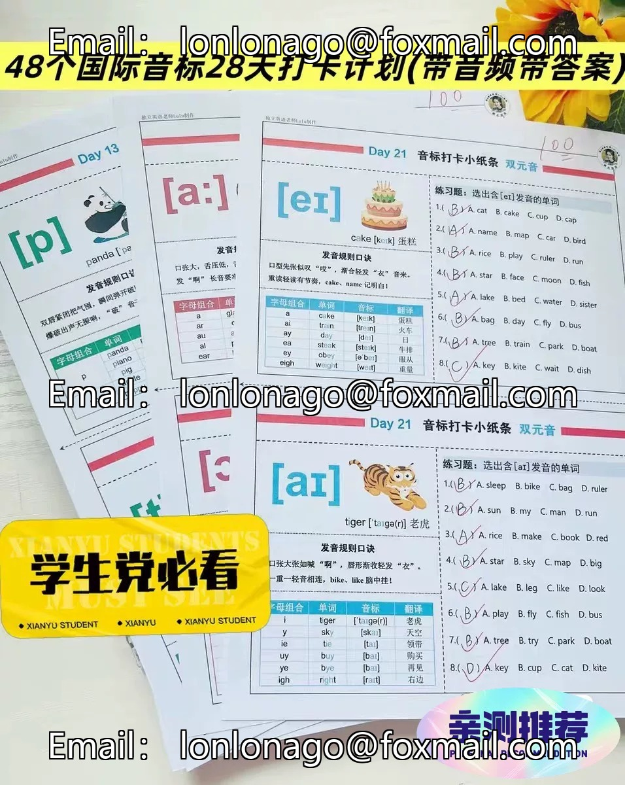

# Yes, "b228 48 International Phonetic Symbols 28 Day Check-in Plan" sounds like a 28-day plan aimed at helping learners master the 48 International Phonetic Symbols. This plan may include daily learning and practicing these phonetic symbols, as well as tracking progress and staying motivated through check-ins.

## Body

B228 48 International Phonetic Alphabets 28 Day Check-in Plan

(Full product description was not available from the source page.)

## Images

## Payment

Here is a pay link on Stripe ( https://buy.stripe.com/3cs8yP7sY87d0vu9AB ). Please contact me lonlonago@foxmail.com after funding $89, and I will send you a complete data files , thank you!

